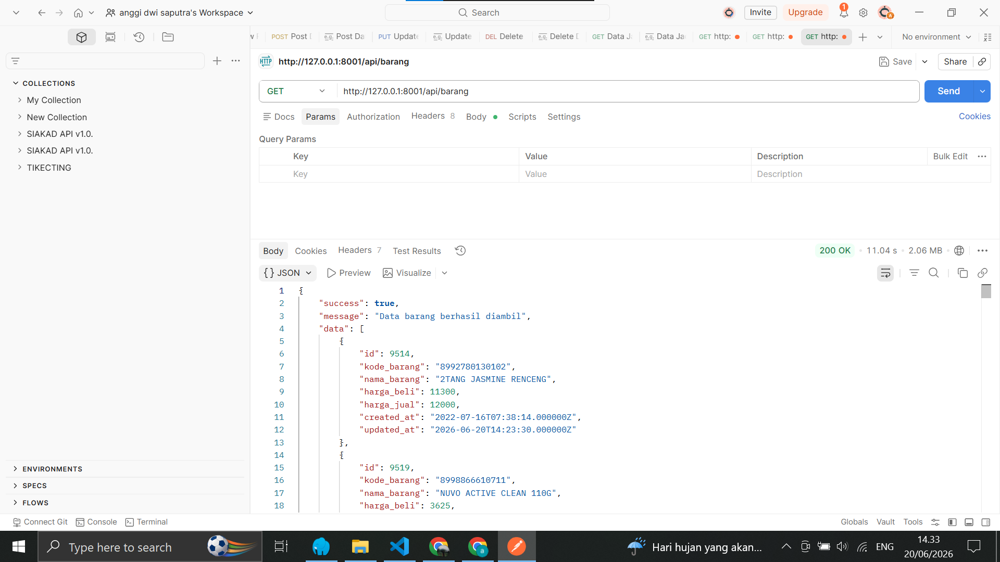
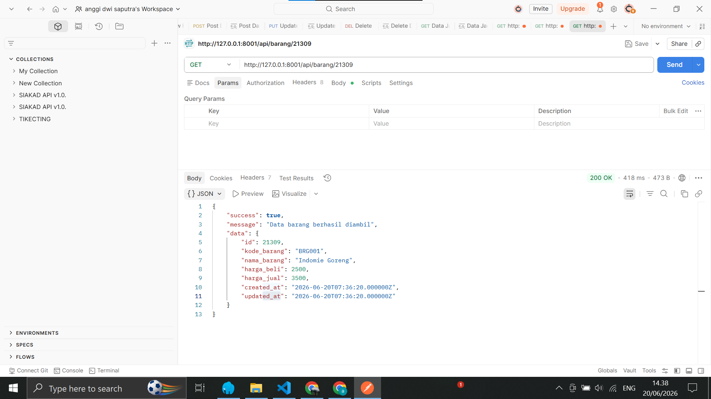
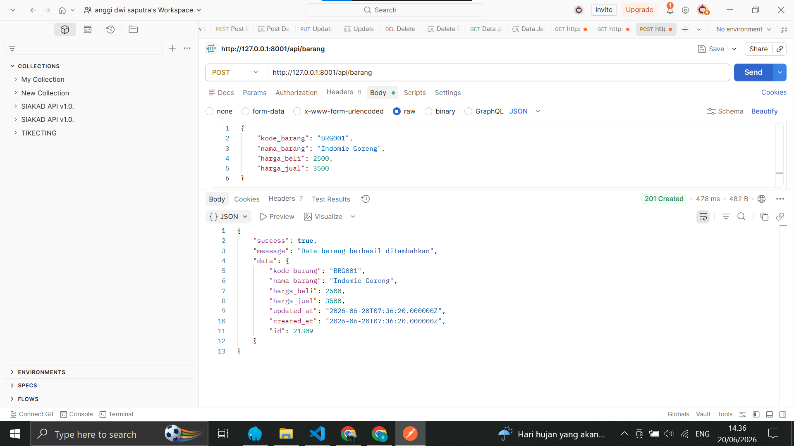
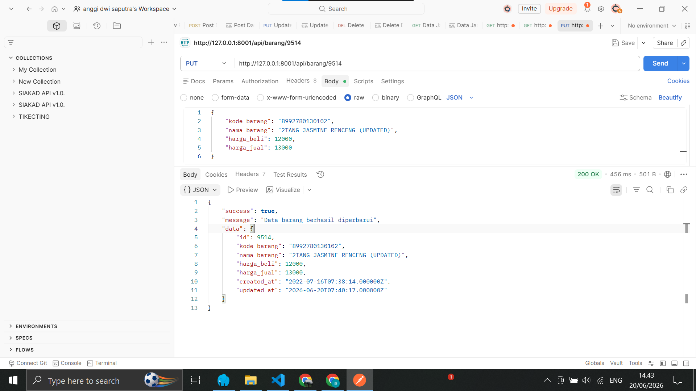
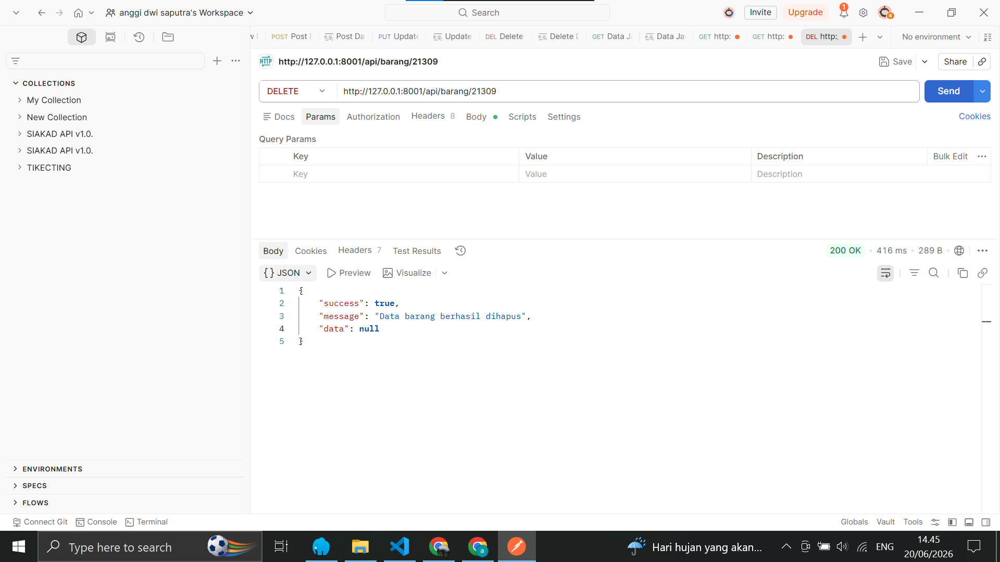

# Barang API - RESTful API Laravel

## Deskripsi Proyek

Proyek ini merupakan sebuah RESTful API untuk manajemen data barang yang dibangun menggunakan Laravel 11. API ini menyediakan fungsionalitas CRUD (Create, Read, Update, Delete) untuk mengelola data barang pada tabel `data_barang`. Proyek ini dibuat sebagai tugas praktikum mata kuliah Web Service.

## Tech Stack

- **Backend Framework:** Laravel 11
- **Database:** MySQL (MariaDB)
- **Database Driver:** PDO MySQL
- **Testing Tool:** Postman
- **PHP Version:** 8.1+

## Fitur

- **GET all** - Mengambil seluruh data barang
- **GET by ID** - Mengambil detail barang berdasarkan ID
- **POST** - Menambahkan data barang baru
- **PUT** - Memperbarui data barang yang sudah ada
- **DELETE** - Menghapus data barang

## Struktur Database

**Nama Database:** `web_service`

**Tabel:** `data_barang`

| Kolom | Tipe Data | Keterangan |
|-------|-----------|------------|
| id | int(11) UNSIGNED | Primary Key, Auto Increment |
| kode_barang | varchar(100) | Kode unik barang |
| nama_barang | varchar(255) | Nama barang |
| harga_beli | int(11) | Harga beli barang |
| harga_jual | int(11) | Harga jual barang |
| created_at | timestamp | Waktu data dibuat |
| updated_at | timestamp | Waktu data diperbarui |

## Struktur Folder (Relevan)

```
barang-api/
├── app/
│   ├── Http/
│   │   └── Controllers/
│   │       └── BarangController.php    # Controller utama CRUD
│   └── Models/
│       └── Barang.php                  # Model Eloquent
├── config/
│   └── database.php                    # Konfigurasi database
├── database/
│   └── migrations/                     # Migrasi database
├── public/
│   ├── screenshots/                    # Screenshot hasil testing
│   └── index.php                       # Entry point aplikasi
├── routes/
│   └── api.php                         # Route API
├── .env                                # Konfigurasi lingkungan
├── bahan praktikum.sql                 # Backup database
├── artisan                             # CLI Laravel
└── composer.json                       # Dependensi PHP
```

## Implementasi Kode

### Model (app/Models/Barang.php)

Model `Barang` merepresentasikan tabel `data_barang` di database. Menggunakan Eloquent ORM untuk interaksi database.

- `$table = 'data_barang'` → menentukan nama tabel
- `$fillable` → field yang boleh diisi massal (mass assignment)

### Controller (app/Http/Controllers/BarangController.php)

Controller menangani logika bisnis untuk setiap operasi CRUD:

| Method | Fungsi |
|--------|--------|
| `index()` | Mengambil semua data barang via `Barang::all()` |
| `store(Request $request)` | Validasi input lalu membuat data baru via `Barang::create()` |
| `show(string $id)` | Mencari data by ID via `Barang::findOrFail()` |
| `update(Request $request, string $id)` | Validasi lalu update data via `Barang::update()` |
| `destroy(string $id)` | Mencari dan menghapus data via `Barang::delete()` |

### Route (routes/api.php)

```php
Route::apiResource('barang', BarangController::class);
```

Mendaftarkan 5 endpoint RESTful secara otomatis.

## Cara Install

### Prasyarat
- PHP 8.1+
- Composer
- MySQL/MariaDB
- Postman (untuk testing)

### Langkah-langkah

1. **Clone atau copy proyek** ke direktori local server
2. **Install dependensi**:
   ```bash
   composer install
   ```
3. **Konfigurasi .env**:
   Copy `.env.example` menjadi `.env`, lalu sesuaikan konfigurasi database:
   ```
   DB_CONNECTION=mysql
   DB_HOST=127.0.0.1
   DB_PORT=3306
   DB_DATABASE=web_service
   DB_USERNAME=root
   DB_PASSWORD=
   ```
4. **Buat database** MySQL dengan nama `web_service`
5. **Import database** dari file `bahan praktikum.sql`:
   ```bash
   mysql -u root -p web_service < "D:\FOLDER SEMESTER 6\web service\pert 10\bahan praktikum.sql"
   ```
   Atau import via phpMyAdmin.
6. **Generate key**:
   ```bash
   php artisan key:generate
   ```
7. **Jalankan server**:
   ```bash
   php artisan serve --port=8001
   ```

## Endpoint API

Base URL: `http://127.0.0.1:8001/api`

| Method | Endpoint | Fungsi | Status Response |
|--------|----------|--------|----------------|
| GET | `/api/barang` | Mengambil semua data barang | 200 OK |
| GET | `/api/barang/{id}` | Mengambil detail barang | 200 OK |
| POST | `/api/barang` | Menambahkan barang baru | 201 Created |
| PUT | `/api/barang/{id}` | Memperbarui data barang | 200 OK |
| DELETE | `/api/barang/{id}` | Menghapus data barang | 200 OK |

### Format Response

Semua response menggunakan format JSON dengan struktur:

```json
{
    "success": true,
    "message": "Pesan sesuai operasi",
    "data": { ... }
}
```

## Cara Pengujian dengan Postman

1. Buka aplikasi **Postman**
2. Buat request baru sesuai endpoint yang ingin diuji
3. Untuk method **POST** dan **PUT**, atur:
   - **Headers:** `Content-Type: application/json`
   - **Body:** raw JSON dengan field `kode_barang`, `nama_barang`, `harga_beli`, `harga_jual`
4. Kirim request dan lihat response yang diterima

## Screenshots

Hasil pengujian API menggunakan Postman:

| Endpoint | Screenshot |
|----------|------------|
| GET all barang |  |
| GET detail barang |  |
| POST tambah barang |  |
| PUT update barang |  |
| DELETE hapus barang |  |

Screenshot tersimpan di folder `public/screenshots/` dan bisa diakses via `http://127.0.0.1:8001/screenshots/nama-file.png` saat server berjalan.

## Kesimpulan

API ini berhasil mengimplementasikan seluruh operasi CRUD pada tabel `data_barang` menggunakan Laravel 11. Pengujian dengan Postman menunjukkan bahwa semua endpoint berfungsi dengan baik, mulai dari mengambil data, menambahkan data baru, memperbarui data, hingga menghapus data.
